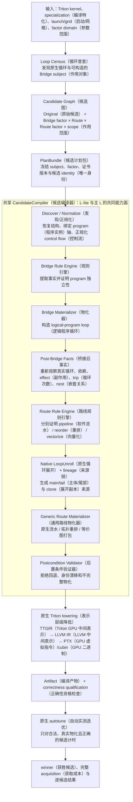
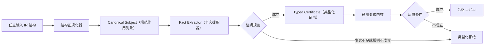
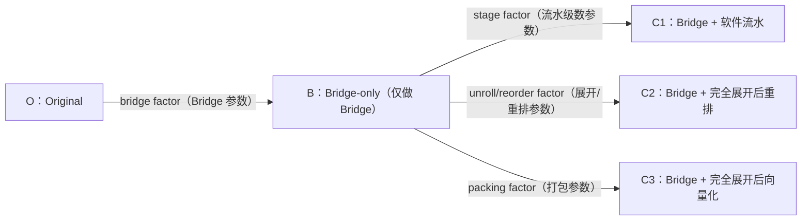
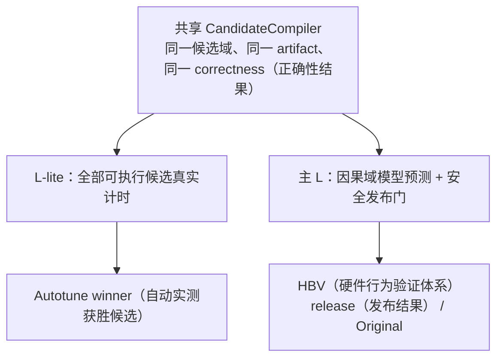

# L-lite（L 项目轻量版）项目架构设计书

> 文档用途：架构评审、实现审计和后续验收
>
> 修订日期：2026-08-26
>
> 上游基线：Triton（面向 GPU（图形处理器）的编程语言和编译器）
> `7c56a5e40f7fd928dfd5c72902d5def0097db73a`（3.6.0 开发基线）
>
> L-lite 实现快照：`25bca1f4ec7404878ba4b52e19d4a5919a1e41ce`
>
> 本次修订：补充总体架构图；将“子域枚举”改写为规则引擎；区分已经实现的通用内核、
> 仍待收敛的结构适配器和尚未完成的产品闭环。

## 1. 文档结论

L-lite 在 Triton 编译器中增加两级循环变换：

1. Bridge（桥接构环变换）先判断能否把多个 Triton logical program（逻辑程序实例）合并
   到一个 physical program（物理程序实例），并把合并后的工作表达为显式循环；
2. Route（循环优化路线）再对 Bridge 后的真实循环，或原 TTIR（Triton 张量级中间表示）
   中本来就存在的循环，选择软件流水、
   完全展开后重排、完全展开后向量化三种机制之一。

Bridge 与 Route 是两个独立的编译干预。它们分别证明合法性、分别保存 factor（变换参数）
和来源，但在候选层通过笛卡尔积联合搜索。这个划分既保留因果归属，也没有放弃整体
kernel（核函数）选优。

本次源码审计得到三个结论。

第一，Bridge 的 program 独立性证明、重排的依赖图调度、一般操作的精确打包，已经是由
IR（中间表示）、SSA（静态单赋值形式）、内存效应和地址关系驱动的规则式实现。它们不读取
kernel 名、算子名、测试集名
或历史性能结果。

第二，评审提出的 case-by-case（逐个案例打补丁）风险确实存在，不能回避。当前
`exact-prefix`（精确动态前缀）路径仍匹配“单 load（内存读取）、单整数加法归约”等窄结构；
state-axis（状态轴）路径虽然比较完整数据流图，但仍使用固定 operation capability（操作语义
能力）名单；总物化入口也以多条结构分支调用不同 adapter（结构适配器）。它们是结构级定制，
不是 workload（工作负载）名称定制，但仍没有完全达到本文定义的统一规则架构。

第三，因此准确状态不是“所有子域已经天然泛化”，而是：

- 通用规则内核已经存在；
- 多类输入已经通过共享正规化和证明逻辑进入这些内核；
- 两条窄 adapter 及总调度结构仍需收敛；
- 在收敛完成并通过正反例、变形测试和新 family holdout（家族留出测试）之前，不能把窄 adapter 写成
  已闭环的通用能力。

本文后续按目标架构介绍系统，同时在每一节标明当前实现和差距。这样，架构图描述的是
要长期维持的责任边界，代码审计表描述的是当前 commit（代码提交版本）实际达到的位置。

## 2. 总体架构

### 2.1 系统全景图



从图中应当先看清四个边界。

**候选控制层不改写 IR。** 它负责枚举、命名和冻结候选，不负责猜测某个候选是否会快。

**规则引擎不做性能选择。** 它只回答一个变换在当前 IR 上是否语义成立，以及需要哪张
可复核证书。

**物化器不重新发明合法性。** 它消费已冻结的 subject 和证书，实施确定性改写；如果输入
不满足证书，必须失败，不能换一条更容易的路径。

**autotune 不承担编译正确性。** 它只测量已经通过合法性、物化、artifact 和数值正确性
检查的 binding（可执行候选实例）。非法候选保留在请求账本中，但不会被执行。

### 2.2 按架构图走完一个候选

以 `Bridge(4) + vectorize(4)` 为例，架构图中的各阶段按以下顺序工作。

**第一步，冻结输入条件。** 系统接收已经 specialization 的 Triton kernel、launch/grid、
目标设备和预注册 factor domain。specialization、grid 或目标设备任一变化，均形成新的输入
身份，不能复用旧候选的证明。

**第二步，执行 Loop Census。** Census 枚举原 TTIR 中真实存在的循环，并调查 program-id
（程序实例编号）是否能形成 Bridge subject。它只建立 population（研究对象全集），不决定
Bridge 或 Route 是否会带来收益。

**第三步，建立 Candidate Graph。** 控制层生成 Original，以及所有预注册的
`bridge_factor × route × route_factor × scope` 请求。某个 cell（候选网格单元）后续可能被拒绝，但此时不能
因预计较慢而不生成它。

**第四步，序列化 PlanBundle。** 候选被绑定到唯一 subject、Bridge factor 4、Route
`vectorize`、Route factor 4、axis divisor（坐标轴除数）、规则版本和 composition hash（组合哈希值）。此后任何
Pass（编译阶段）都
无权私自更换 factor 或作用对象。

**第五步，Discover 与正规化。** 编译器读取真实 TTIR，解析 program-id、地址表达式、
control flow 和 effect。若存在可等价正规化的提前 return（提前返回）或 pure helper（纯辅助函数），
在这一层将其转换为 Bridge 规则能够理解的 canonical representation（规范表示）；无法证明等价则拒绝。

**第六步，Bridge 证明与物化。** Bridge Rule Engine 证明四个 logical program 的坐标可
恢复、尾部可守卫、写 footprint（访问范围）不冲突且 effect 闭合。证书成立后，Bridge Materializer
构造 factor 4 的显式循环，并保存 logical lane（逻辑通道）来源。

**第七步，重新提取 Facts。** 系统面对 Bridge 后真实 `scf.for`（结构化控制流循环），重新计算 trip、carried
state（循环携带状态）、nest、operation graph（操作图）、mask（掩码）和 effect。Bridge 前“没有循环”或“某操作在函数顶层”
等旧事实到此失效。

**第八步，Route 证明。** 向量化规则查找四个 lane 中有 lineage 对应的等价 operation graph，
逐节点验证 operation（操作）语义、类型、属性、operand（操作数）、mask、地址和 effect。Bridge 证书只说明
program 可以合并，不能替代这一步。

**第九步，展开与物化。** 原生 LoopUnroll 按 factor 4 产生 clones 并保留来源。通用
vectorization（向量化）kernel 依据等价组构造宽值和宽 operation。若只找到两路等价，不能擅自改成
factor 2；当前 factor 4 候选应失败，factor 2 由另一个候选 cell 表达。

**第十步，后置验证。** Validator 检查目标 subject 已被正确消费、packing artifact（打包产物）确实
出现、Bridge 和 Route lineage 仍对应 PlanBundle，且临时 role（阶段角色）属性没有泄漏。任何不一致都
令候选编译失败。

**第十一步，原生 lowering 与资格检查。** 合格 TTIR 继续经过 TritonGPU、LLVM 和目标后端。
系统保存 artifact identity，并与 Original 和独立 oracle（独立正确性参照）做数值比较。只有物化和数值均
合格的 binding 才进入计时。

**第十二步，autotune 选择。** L-lite 对全部合格 binding 实测，报告 winner 和完整
acquisition。主 L 则读取同一批候选和证据，用因果域模型与发布门选择候选。两边的区别从
这一站才开始。

### 2.3 一条规则式 Pass 的内部结构



这张图是判断“规则式”还是“case-by-case”的核心标准。动态边界、提前 return、helper、
嵌套 region（区域）和 sibling state（同级状态）不应各自拥有一套从发现到物化的私有优化器。它们只能在必要
时提供结构正规化或证明适配，最后必须落到相同的 canonical subject、证书类型和通用变换
内核。

### 2.4 Bridge 与 Route 如何既分开又联合优化



候选空间可写为：

```text
bridge_factor × route × route_factor × structural_scope
```

其中 `bridge_factor=1` 是 Bridge identity。它表示不构造 program-coarsening（程序实例粗化）循环，但不
妨碍 Route 作用于原 TTIR 已有循环。

Bridge factor 与 Route factor 不能合并为一个字段。前者决定一个 physical program 承担
多少 logical program；后者分别表示流水 stage 数、重排展开宽度或向量打包宽度。两个数字
偶尔相等，只是某个候选的取值相等，不代表语义相同。

## 3. 架构约束

以下约束是设计边界，不是实现建议。

### 3.1 规则只能读取与语义直接相关的事实

允许读取的事实包括：

- `scf.for` 的上下界、步长、静态或动态 trip、嵌套关系和 carried value（循环携带值）；
- SSA def-use（定义—使用关系）、dominance（支配关系）、region 结构和 operation effect（操作副作用）；
- pointer root（指针根）、仿射偏移、mask、alignment（对齐）、cache/eviction（缓存/逐出）属性和读写 footprint；
- program-id 轴、grid extent（网格范围）和多轴 mixed-radix（混合进制）映射；
- dtype（数据类型）、tensor shape（张量形状）、显式资源或代码体积预算；
- PlanBundle 中预注册的 subject、route、factor 和结构 scope。

禁止读取的内容包括：

- Python（编程语言）函数名、kernel 名、源码路径和算子库身份；
- “GEMM（通用矩阵乘法）”“Sinkhorn（交替行列归一化算法）”“Hadamard（逐元素乘积）”等 workload 标签；
- benchmark（基准测试）、测试集或 PR（合并请求）编号；
- 某个 shape（形状）过去是否获胜；
- 计时结果、温度、功率、时钟、GPU utilization（利用率）；
- 为某份开发数据手写的操作数量组合。

最后一项尤其重要。删除 kernel 名不等于去掉定制。如果规则要求“恰好四个 div（除法），后接一个
add（加法），再接四个 div”，它仍在用操作配方识别一个 workload，只是把名字换成了结构签名。

### 3.2 准入、物化、正确性和性能必须分层

| 层次 | 回答的问题 | 失败后怎么处理 |
|---|---|---|
| 可观察性 | 是否存在一个可定位的 subject | 记录 `SUBJECT_NOT_FOUND` |
| 合法性 | 变换是否保持程序语义 | 记录规则和缺失事实，不生成可执行 binding |
| 物化 | 指定机制是否真实写入 IR | 记录 `MATERIALIZATION_FAILED`，禁止回退 |
| artifact | 后续 lowering 后是否仍是目标候选 | 记录 artifact 证据不足 |
| 正确性 | 与 Original 和独立 oracle 是否一致 | 标记 incorrect/ambiguous（错误/结果不明确），不计时 |
| 性能 | 候选是否更快 | 由 autotune 实测，不影响前五层判定 |

不能用性能结果倒推合法性，也不能用“数值测试碰巧通过”替代静态等价证明。测试样本没有
覆盖到的错误路径，可能在部署后才出现。

### 3.3 失败必须发生在最早责任层

地址独立性不能证明，应由 Bridge 规则拒绝；操作图不等价，应由向量化规则拒绝；变换后
没有目标结构，应由 validator 拒绝；数值不一致，应由 correctness 层拒绝。将所有失败都
推迟到 GPU 运行，会同时损害安全性、调试效率和 autotune 公平性。

### 3.4 不允许 silent fallback（静默回退）

候选请求 `Bridge(4) + vectorize(4)`，最终却生成 Original，不是一个“较慢候选”，而是身份
伪造。每个候选必须在整个链路保存：

```text
candidate_ref（候选引用）
  + source/subject_ref（来源/作用对象引用）
  + bridge factor 与 axis divisors
  + route 与 route factor
  + normalization/certificate（正规化/证书）版本
  + main/tail 与 operation lineage
  + TTIR/PTX/cubin identity
```

validator 发现任一字段丢失，应令候选编译失败。

## 4. 六个 TTIR Pass 与原生 LoopUnroll

L-lite 使用六个新增 TTIR Pass，并对原生 LoopUnroll 做最小 lineage 扩展。它们不是七种
优化机制，而是同一候选编译事务的七个责任阶段。

| 顺序 | 阶段 | 责任 | 不应承担的责任 |
|---|---|---|---|
| 1 | Discover（发现） | 发现原生循环和可构造 Bridge 的 program 事实 | 不改写、不选 winner |
| 2 | Bridge Program Coarsening（Bridge 程序实例粗化） | 按已证明证书构造 logical-program loop | 不判断 Route 是否有收益 |
| 3 | Facts（事实重提取） | 对 Bridge 后真实 IR 重新提取 loop/effect/nest 能力 | 不复用 Bridge 前旧假设 |
| 4 | Decision（决策闭合） | 将 PlanBundle 与事实、证书和唯一 subject 对齐 | 不静默改 factor 或 route |
| 5 | 原生 LoopUnroll | 按 factor 展开并保存 main/tail、clone lineage | 不做 L-lite 性能选择 |
| 6 | Materialize（物化） | 调用流水、重排或向量化通用内核 | 不吞掉失败后返回 Original |
| 7 | Validate（验证） | 检查计划、物化结果和来源一一对应 | 不以“Pass 退出码为 0”代替检查 |

新增 Pass 的注册位于
[`Passes.td`](../include/triton/Dialect/Triton/Transforms/Passes.td#L93-L125)，实现集中在
[`HBVLoop.cpp`](../lib/Dialect/Triton/Transforms/HBVLoop.cpp)，Python wrapper（封装接口）位于
[`passes.cc`](../python/src/passes.cc#L39-L59)。

原生 LoopUnroll 的扩展位于
[`LoopUnroll.cpp`](../lib/Dialect/Triton/Transforms/LoopUnroll.cpp)。扩展只增加 source trip、
main/tail partition（分区）和 clone operation group（克隆操作组）来源，不另写一套展开器。这使 L-lite 能继续
复用 Triton/MLIR（多层中间表示基础设施）的展开语义，同时让后续调度和验证知道每个 clone 来自哪次迭代、哪个
source operation。

## 5. 统一规则模型

### 5.1 Canonical Subject（规范作用对象）

所有规则首先面对统一对象，而不是 benchmark 子域。一个 canonical loop subject 至少包含：

```text
SubjectRef（作用对象引用）
LoopDomain（循环域）      = {lower（下界）, upper（上界）, step（步长）, static/dynamic trip（静态/动态循环次数）}
StructuralScope（结构作用范围） = {loop（循环）, nest path（嵌套路径）, bridge origin（Bridge 来源）}
StateBoundary（状态边界）   = {iter args（迭代参数）, yields（循环返回值）, recurrence edges（递推边）}
EffectSummary（副作用摘要）   = {reads（读取）, writes（写入）, atomics（原子操作）, volatile（易变操作）, unknown effects（未知副作用）}
AddressSummary（地址摘要）  = {pointer roots（指针根）, affine/symbolic footprints（仿射/符号访问范围）, masks（掩码）}
ControlSummary（控制流摘要）  = {guards（守卫）, early exits（提前退出）, nested regions（嵌套区域）, calls（调用）}
Lineage（来源链）         = {source op（源操作）, logical lane（逻辑通道）, main/tail partition（主体/尾部分区）}
```

动态循环、helper 或提前 return 不是新的优化机制。它们只会改变 `ControlSummary`、
`LoopDomain` 或正规化步骤。

### 5.2 FactSet（事实集合）

FactSet 是从当前 IR 直接得到的只读事实。Bridge 物化后必须重新生成 FactSet，因为新的
显式循环、边界 guard（守卫）、nest 和 operation graph 与 Bridge 前不同。使用 Bridge 前的 trip 或
effect 直接决定 Bridge 后 Route，是典型的阶段穿透错误。

事实应携带 producer（生产者）和版本。例如：

```text
fact（事实）: program_partition_disjoint
producer（生产者）: TritonLoopBridgeDiscover
schema（模式版本）: bridge_pid_partitioned_disjoint_v1
subject（作用对象）: bridge-subject-...
```

没有 producer 的布尔字段不能进入 Decision。否则代码无法区分事实来自真实分析、外部
猜测还是历史缓存。

### 5.3 Typed Certificate（类型化证书）

证书表示“一组规则对某个 subject 成立”，而不是“这个 kernel 看起来可优化”。证书至少
绑定：

- subject identity；
- 规则版本；
- 被证明的性质；
- 使用的事实 hash；
- route 和 factor 的适用范围；
- 失败时的稳定原因码。

Bridge 证书不能被向量化直接借用。Bridge 证明 logical program 可以安全合并，不证明多次
迭代的操作图可以打包；软件流水证书也不能替代重排的依赖证明。

### 5.4 规则、适配器与 case 的区别

| 类型 | 定义 | 是否允许 |
|---|---|---|
| 证明规则 | 对所有满足同一语义条件的 IR 都成立 | 允许 |
| 结构正规化器 | 把等价的控制流/表示转换成 canonical subject | 允许，但必须单独证明等价 |
| operation 语义能力 | 依据 MLIR interface/trait（接口/特征）或明确代数性质判断 | 允许，需有可审计语义来源 |
| workload matcher（工作负载匹配器） | 读取函数名、算子名、仓库、PR 或 benchmark | 禁止 |
| 配方 matcher（配方匹配器） | 要求固定操作数量和固定组合，只为覆盖已知样本 | 禁止 |
| 性能回忆规则 | 因历史样本快而准入 | 禁止进入合法性层 |

例如，`arith.addf` 和 `arith.mulf` 的物理实现不同，Pass 可以依据 operation 的 trait、类型和
属性分别调用合法的 clone/pack（克隆/打包）逻辑；这属于 operation 语义分派。若代码要求“四个除法、
一个求和、再四个除法”才识别 state-axis，则属于配方 matcher。

## 6. Bridge：规则式 program coarsening（程序实例粗化）

### 6.1 目的

Triton 的 `tl.program_id(axis)` 将工作分配给大量 logical program。Bridge 尝试让一个
physical program 顺序承担相邻的若干 logical program，从而在后续产生一个可被 Route
优化的显式循环。

以单轴 factor 4 为例，物理 program `p` 恢复的 logical program 为：

```text
4p, 4p+1, 4p+2, 4p+3
```

若最后一组不足四个，Bridge 为每个 logical lane 建立边界 predicate（谓词条件）。它不能越过原 grid，
也不能因一个 lane 越界而终止其他 lane。

### 6.2 Bridge 证明规则

Bridge 不按“单轴、多轴、提前 return、helper”分别定义优化。统一规则如下。

**B1：坐标可恢复。** 每个被合并的 logical program 坐标必须能由 physical program 坐标、
lane 和 axis divisor 唯一恢复。多轴时使用 mixed-radix 展开，divisor 乘积等于 Bridge factor。

**B2：边界可守卫。** 对非整除 grid，能为每个 logical program 生成与原 launch 等价的 active
predicate（有效谓词）。函数级提前 return 必须能正规化为当前 lane 的局部 guard。

**B3：外部可见写互不冲突。** 对每个 store，证明相邻 logical program 的写 footprint 不
重叠；同一 pointer root 上存在读写时，还要排除跨 program alias（别名冲突）。

**B4：effect 闭合。** atomic、volatile、未知 memory effect（内存副作用）、不可解析 call 或跨 program
同步依赖必须拒绝。结构容器要递归检查 region 内部 effect，不能只看顶层 operation。

**B5：状态边界闭合。** carried state 只能属于单个 logical program 或有明确组合语义；
不能把原本并行、互相依赖的 program 假装成独立 lane。

**B6：计划与事实对应。** factor、axis divisor、subject 和证书版本必须与 PlanBundle 完全
一致。Pass 不能因为 factor 4 不成立就自动尝试 factor 2。

当前核心证明入口是
[`certifyBridgeProgramIndependence`](../lib/Dialect/Triton/Transforms/HBVLoop.cpp#L2152)。它递归
收集 load/store/effect，追踪 pointer root 和 program-id footprint，并拒绝未消除的读写
alias。真正构造循环的入口是
[`LoopBridgeProgramCoarseningPass`](../lib/Dialect/Triton/Transforms/HBVLoop.cpp#L6191)。

### 6.3 Bridge 物化算法

证书成立后，物化器执行固定步骤：

1. 根据 factor 和 axis divisor 缩小 physical grid；
2. 建立表示 logical lane 的 `scf.for`；
3. 从 `physical_pid + lane` 恢复每个原始 program-id；
4. 为尾部 lane 生成 active predicate；
5. 在循环体内克隆原 program 工作，并用 logical pid 替换原 program-id；
6. 保留 Bridge origin、factor、axis divisor 和 subject lineage；
7. 再运行 Facts，禁止沿用构造前的 Route 能力结论。

### 6.4 不同输入如何自然落入同一规则

| 输入结构 | 正规化或事实变化 | 仍由哪些统一规则决定 |
|---|---|---|
| 单轴 grid | divisor 向量只有一个元素 | B1、B3、B4 |
| 二维/三维 grid | lane 用 mixed-radix 恢复多轴坐标 | B1、B3、B4 |
| grid 不能整除 factor | 增加 per-lane active predicate | B2 |
| 入口有提前 return | 将函数退出正规化为 continuation guard（继续执行守卫） | B2、B4 |
| 主体调用 pure helper | 在 call graph（调用图）闭合后内联或透明分析 | B4 |
| store 藏在 `scf.if` | effect walker（副作用遍历器）递归进入 region | B3、B4 |
| 只有计算、没有 store | 写集合为空，B3 平凡成立；仍检查 B4/B5 | B4、B5 |
| 只有 store、没有 load | 正常计算写 footprint，不要求存在 load | B3、B4 |
| logical program 间有递推 | 状态边界不闭合 | B5 拒绝 |

这张表不是八个 Bridge 子域。它展示的是同一算法面对不同 IR 表示时，哪些事实发生变化，
以及相同规则如何给出结论。

### 6.5 Bridge 当前实现判定

Bridge 的独立性内核已达到规则式设计的主体要求：它不要求固定 load/store 配方，也不读取
workload identity。仍需继续收敛的是正规化器注册方式和历史窄 matcher 的物理隔离。新的
Bridge 输入类型只能通过新增通用结构正规化或补充可证明的地址/effect 规则进入，不能新增
`if (looksLikeKnownKernel)`（如果看起来像已知核函数）分支。

## 7. 完全展开后重排：依赖图上的稳定拓扑调度

### 7.1 目的

完全展开把多次迭代复制到同一 block（基本块）。原生展开通常保持 iteration-major（按迭代排列）顺序：先放完第
0 次迭代的操作，再放第 1 次。重排 Route 在不违反依赖的前提下，把来自同一个 source
operation 的 clones 尽量排在一起，形成 phase-major（按操作阶段排列）顺序。

重排不是“把 load 放前面、compute（计算）放中间、store（内存写入）放后面”。该描述只适用于某些循环，不能
作为准入条件。通用定义是：

> 在保留所有必须发生在前的关系时，对展开后的 operation 做确定性稳定拓扑排序；当多个
> operation 同时可执行时，优先选择 lineage 相同的 operation group。

### 7.2 重排规则

**R1：展开边界闭合。** loop 的 yield 数量必须与 init args（初始参数）对应，main/tail 语义可由原生
LoopUnroll 正确表达。

**R2：SSA 顺序不可破坏。** 若 operation B 的 operand 来自 A，则调度图必须包含 `A → B`。

**R3：可观察 effect 顺序不可猜。** effectful（有副作用）或不可 speculatable（不可推测执行）的 operation 按源顺序
加入 barrier chain（屏障链）。只有额外证明两个 memory effect 独立，才允许删除相应顺序边。

**R4：tail 保持原顺序。** 非整除 factor 的 tail 不能参与未经证明的跨边界重排。

**R5：排序确定。** 多个合法拓扑序中，用 source group rank（源组次序）和原 block 顺序做稳定 tie-break（平局裁决）。
同一 IR、同一 Plan 必须生成相同结果。

**R6：嵌套范围显式。** 一次候选只使用一个 route identity。若作用于 loop nest，scope 必须
明确给出被展开的组合 extent（范围）；不能在 inner（内层循环）偷换成另一条 Route。

通用入口是
[`materializeOperationNeutralPhase`](../lib/Dialect/Triton/Transforms/HBVLoop.cpp#L8124)。实现
为真实 operation 建图：SSA def-use 形成精确边；effectful/non-speculatable operation 形成
保守 barrier chain；调度优先级来自 clone lineage，不来自 opcode（操作码）配方。

### 7.3 三类循环使用同一个算法

```text
示例 A：load → compute → store
图中存在三组 source lineage；若依赖允许，可形成 load-group、compute-group、store-group。

示例 B：compute → compute，没有内存操作
图中只有算术 SSA 边；算法仍按可行拓扑序聚合重复计算，不需要伪造 load/store phase。

示例 C：compute → store，没有 load
store 进入 effect barrier，计算按 SSA 边约束；缺少 load 不构成拒绝原因。
```

因此，“循环必须有 load”是错误的隐性定制；“所有移动都必须满足依赖图”才是机制规则。

### 7.4 动态 trip 与 main/tail

factor 4、trip 10 时，原生 LoopUnroll 可形成两个完整 main group 加一个有序 tail。重排只
作用于已由 lineage 标记的 main clone；tail 保持原顺序。动态 trip 只有在运行时边界、main
分区和 tail guard 都能由证书表达时才能进入。否则拒绝的原因是边界证明不足，不是“动态
循环是一种新子域”。

### 7.5 重排当前实现判定

operation-neutral（操作类型中立）稳定拓扑调度已经是可复用核心。源码中仍保留早期针对 load/compute/
reduction（归约）形态的窄证书函数。后续必须将 active registry（生效规则注册表）限定到通用依赖证书，历史证据读取
与生产准入物理分离；不得让旧 matcher 因调用顺序变化重新成为 authority（权威来源）。

## 8. 完全展开后向量化：等价操作图打包

### 8.1 目的

展开后，不同迭代或不同 sibling state 可能出现多份结构相同的操作。向量化 Route 把这些
标量或窄 tensor 操作组织成更宽值，在宽值上执行等价操作，再将结果交给原 consumer（使用者操作）。

这里的“向量化”不是简单把源码变量放进 `tl.stack`。编译器必须证明 lane 之间存在一一
对应的 operation graph，并且打包不会改变 mask、地址、类型、属性和外部可见 effect。

### 8.2 向量化规则

**V1：lane 来源明确。** 每个待打包 operation 必须有 source operation 和 logical lane
lineage；不能仅按相邻位置猜测对应关系。

**V2：图结构同构。** 对应节点的 operation 语义、结果数量、类型、属性和 operand 对应
一致。共同 invariant（循环不变量）operand 可以 broadcast（广播）；lane-local（通道局部）operand 必须递归建立对应组。

**V3：operation 可打包。** regionless（不含区域）、纯、可 speculatable 的 elementwise（逐元素）operation 可依据
MLIR trait 进入通用 pack；有 region 或特殊语义的 operation 需要明确的语义接口，不能靠
名称相似放行。

**V4：内存语义精确。** load/store 还要比较 pointer 映射、mask、other（掩码外填充值）、boundary（边界）、cache、
eviction 和地址冲突。store lane 必须无冲突，且不能破坏有意义的覆盖顺序。

**V5：控制与 recurrence（递推关系）闭合。** 被打包节点不能携带未建模的跨 lane recurrence。cross-state（跨状态）
reduction 要作为图中的显式边处理，不能假设 sibling 永远独立。

**V6：动态有效集合可表达。** 动态 lane 只有在存在可证明上界、有效集合可由 predicate
表达、无效 lane 有语义正确的 neutral value（中性值）时才能放入静态容器。

**V7：资源预算独立于语义。** 代码体积或容器宽度超预算可以由 acquisition/capability 门
拒绝，但不得反过来把某个训练 shape 写成向量化的语义定义。

一般操作打包入口是
[`materializeExactOperationVectorization`](../lib/Dialect/Triton/Transforms/HBVLoop.cpp#L9413)。
它先调用通用重排，将对应 clone 放到可比较位置，再按 operation group、类型、属性和 operand
关系构造宽操作。

### 8.3 load、store 和一般 elementwise 如何落入规则

它们不是三个 workload 子域，而是同一等价图规则下的三类 operation 语义。

| operation 类别 | 共享检查 | 额外检查 |
|---|---|---|
| 一般 elementwise | V1、V2、V3、V5 | trait、类型和属性相同 |
| load | V1、V2、V4、V5 | pointer、mask、other、cache/boundary 一致 |
| store | V1、V2、V4、V5 | value 图对应、写地址无冲突、effect 顺序闭合 |

使用不同的 operation verifier（操作验证器）是必要的语义分派。为某个算子组合专门写“先打包四个 load，
再打一组 div”则是 case-by-case。

### 8.4 sibling state 的通用表达

若程序连续生成 `n` 个状态对象，且这些对象经历同构数据流，向量化器可以把 sibling identity
当作新 lane 轴。`n` 可以是 2、3、4 或更大，不由变量名决定。

应使用以下图模型：

```text
lane-local node（通道局部节点）：每个 sibling 各自存在、彼此同构的节点
uniform node（统一节点）：所有 sibling 共享的 invariant
cross-lane node（跨通道节点）：显式合并 sibling 的 reduction/consumer
boundary node（边界节点）：暂时无法继续向上打包、但可以安全形成容器边界的值
```

识别器从候选输出反向比较完整 def-use 图。遇到同构 lane-local node 时继续递归；遇到 uniform
值时 broadcast；遇到 cross-lane node 时保留其归约边；遇到不等价或未知 effect 时拒绝。
这套规则不应知道变量是否叫 `r0`，也不应知道代码是否属于 Sinkhorn。

### 8.5 exact-prefix 的通用表达

运行时有效元素为 `[0, N)`、静态已知最大宽度为 `W` 时，可以构造 `lane < N` mask，把无效
lane 填成已证明的 neutral element，再执行宽操作。合法性来自四项事实：

1. 有效集合确实是连续前缀；
2. `W` 是可证明上界；
3. 被替换操作具有明确的 lane-wise（逐通道）或 reduction 语义；
4. neutral value 与 combiner（合并运算）的代数性质已证明。

`exact-prefix` 因而是动态有效 lane 的正规化方式，仍属于完全展开后向量化，不是第四条
Route。

### 8.6 向量化当前实现判定

当前实现并非整体 case-by-case，但还没有完全收敛：

- `isGenericExactPackableOperation` 使用 elementwise trait、effect 和 tensor 类型，属于通用
  capability（能力）规则；
- `materializeExactOperationVectorization` 按 lineage 和等价 operation group 打包，属于
  通用变换内核；
- `matchExactPrefixReduction` 当前要求一个特定整数加法归约结构，仍是窄 matcher；
- state-axis 图比较已经不依赖 sibling 数量和变量名，但
  `isStateAxisElementwiseCapability` 仍列举有限 operation 名；
- `HBVLoopMaterializePass` 仍为 exact-prefix、state-axis、Bridge logical、runtime guarded（运行时守卫）等
  路径保留显式分支，尚未形成统一的 adapter registry（适配器注册表）。

因此，本次评审后将 exact-prefix 和 state-axis 标记为 `PARTIAL`，不能以“已经支持某个样例”
表述为通用能力。它们重新进入 active authority（生效权威）的条件见第 12 节。

## 9. 软件流水：复用原生 Triton 机制

软件流水 Route 不由 L-lite 重写后端 pipeline scheduler（流水调度器）。L-lite 的责任是：

1. 定位准确的 live-loop subject（存活循环作用对象）；
2. 证明该 subject 具备原生 pipeline 所需的加载服务和跨迭代依赖条件；
3. 写入并保存 stage 请求；
4. 由原生 TritonGPU pipeline 建立实际 schedule（调度）；
5. 在后续 artifact 层确认请求没有被静默消除。

Bridge 能构造 `scf.for`，不代表该循环必然可流水化。一个只有 store 的 Bridge loop 仍可能
适合重排，但没有可提前搬运的 load service（加载服务阶段），软件流水应 route-local（路线局部）拒绝。这个拒绝不能
污染重排和向量化的合法性。

## 10. 当前代码审计：是否 case-by-case

### 10.1 审计标准

本次审计不仅搜索 workload 名，还检查以下隐性定制：

- 固定操作数量；
- 固定操作序列；
- 固定 dtype/shape/factor 与某个已知样本绑定；
- 用 location（源码位置）、source path（源码路径）或 hash（哈希值）代替 workload 名；
- 一个 adapter 同时完成识别、变换和性能判断；
- 新增输入只能再加一条旁路，不能进入共享内核。

### 10.2 审计结果

| 实现位置 | 当前性质 | 判定 |
|---|---|---|
| `certifyBridgeProgramIndependence` | pointer root、footprint、effect、alias 规则 | `RULE-BASED`（规则驱动） |
| `certifyOperationNeutralFullUnrollReorder` | loop 边界和 carried-result 闭合 | `RULE-BASED` |
| `materializeOperationNeutralPhase` | SSA/effect 图上的稳定拓扑排序 | `RULE-BASED` |
| `isGenericExactPackableOperation` | MLIR trait、effect、tensor 类型 | `RULE-BASED` |
| `materializeExactOperationVectorization` | lineage 驱动的等价组打包 | `RULE-BASED` |
| `matchExactPrefixReduction` | 单 pointer/load/整数 add 的窄形态 | `STRUCTURAL CASE`（结构特例） |
| `isStateAxisElementwiseCapability` | 固定 operation 名单 | `LIMITED CAPABILITY LIST`（有限能力名单） |
| `matchStateAxisNormalization` | 数据流图驱动，但入口仍围绕共享 denominator（分母）形态 | `PARTIAL`（部分完成） |
| `HBVLoopMaterializePass` 总分派 | 多条 adapter 分支，无正式统一 registry | `ARCHITECTURE DEBT`（架构债务） |
| 历史 load/compute/reduction 证书 | 早期窄结构仍留在同一源文件 | `AUTHORITY RISK`（权威污染风险） |

审计结论是：评审者看到的“子域枚举”不是纯粹的文档误会。大部分核心已经规则化，但两条
窄结构和总调度方式仍会让新增结构以“再加一个 adapter”的方式增长。如果不整改，长期会
退化成 case-by-case。

## 11. 规则化整改方案

### 11.1 统一成五个部件

每条 Route 的实现必须拆成以下部件：

```text
SubjectNormalizer（作用对象正规化器）
  → FactExtractor（事实提取器）
  → ProofRuleRegistry（证明规则注册表）
  → GenericTransformationKernel（通用变换内核）
  → PostconditionValidator（后置条件验证器）
```

`SubjectNormalizer` 只做等价表示转换，例如将 lane-local early return 变成 guard，或将动态
连续前缀表达为静态容器加 mask。它不判断收益，也不直接生成最终优化。

`FactExtractor` 对正规化后的 IR 产生统一 FactSet。不同 adapter 不能私自添加没有 producer
或 schema 的布尔开关。

`ProofRuleRegistry` 中每条规则声明自己消费的事实、产生的证书、适用 Route 和失败原因。
规则之间不得按优先级“碰运气”；Plan 指定的机制必须由唯一规则闭合。

`GenericTransformationKernel` 只消费 canonical subject 和证书。重排只有依赖图调度内核；
向量化只有等价图打包内核；Bridge 只有 program-coarsening 内核。

`PostconditionValidator` 重新观察 IR，证明目标结构出现、旧 subject 被正确消费、lineage 没有
丢失。它不能只相信 materializer 返回 `success()`（成功状态）。

### 11.2 exact-prefix 整改

不再以“一次 load + AddI（整数加法）”定义 exact-prefix。新的正规化器只负责识别 `[0,N)` 有效域和静态
上界；operation/reduction 的合法性由通用 operation capability 与 monoid certificate（幺半群证书）决定。

如果 combiner 没有可证明的 identity、结合律要求与数值合同，则拒绝。不能为了覆盖已知
PR 再添加一个 opcode 组合。原窄 matcher 可保留为历史证据 reader（读取器），但不得注册为生产规则。

### 11.3 state-axis 整改

将固定 operation 名单替换为两类接口：

- 对 regionless、pure、speculatable、elementwise operation，依据 MLIR trait 通用 clone；
- 对 reduction、load/store 或带 region operation，要求显式语义 verifier，证明 combiner、
  地址、mask、effect 和 lane 映射。

识别入口从“寻找某个共享 denominator”改为“从多个候选 sibling outputs（同级输出）反向建立最大同构
子图”。共享 denominator 只是图中可能出现的 cross-lane node，不再是机制定义。

### 11.4 adapter registry

每个 adapter 注册项至少包含：

```text
adapter_id（适配器编号）
input structural predicate（输入结构谓词）
normalization equivalence proof（正规化等价性证明）
produced canonical subject schema（产出的规范作用对象模式）
compatible routes（兼容路线）
post-normalization invariants（正规化后不变量）
positive tests（正例测试）
earliest-layer negative tests（最早责任层反例测试）
```

registry 不允许出现 workload 名和性能标签。新增 adapter 必须证明它只是表示正规化，而不
是第四种变换机制。如果它改变的因果机理与三条 Route 都不同，才应经过独立架构评审决定
是否新增 Route。

### 11.5 active 与 historical authority 分离

当前 `HBVLoop.cpp` 超过一万行，事实、历史 matcher、Plan parser（计划解析器）、物化器和 validator 混在
同一翻译单元。建议拆为：

```text
HBVLoopSubject.cpp
HBVLoopFacts.cpp
HBVLoopRules.cpp
HBVLoopBridge.cpp
HBVLoopReorder.cpp
HBVLoopVectorize.cpp
HBVLoopPlan.cpp
HBVLoopValidate.cpp
HBVLoopHistoricalEvidence.cpp
```

拆分的目的不是整理文件，而是让依赖方向可检查：historical reader（历史证据读取器）不能被 active registry
调用；Facts 不读取性能；Materialize 不修改 Plan；Validate 不补做变换。

## 12. 规则式能力的验收标准

一条能力只有同时满足以下条件才能标记 `PROVED`（已证明）。

### 12.1 规则级证据

- 规则输入只包含 IR、SSA、effect、地址、类型和显式计划事实；
- 每个条件能解释保护了哪项语义；
- 证书绑定 subject、规则版本和事实 hash；
- 不存在 kernel/workload/shape identity；
- 不存在只为一个已知样本设计的操作配方。

### 12.2 正反例

每条规则至少具备：

- 一个最小正例，证明合法且可物化；
- 一个只改变单项条件的反例，在最早责任层拒绝；
- 一个 silent-fallback 反例，确认 validator 能发现未物化；
- 一个 metamorphic（变形）测试，例如重命名、插入无关纯操作、改变 sibling 数量或等价重排后
  结论不应变化；
- 一个未参与规则开发的新 family holdout。

### 12.3 组合证据

Bridge 与三条 Route 必须分别覆盖：

```text
Original loop（原始循环）
Bridge-created loop（Bridge 构造的循环）
static divisible trip（静态且可整除的循环次数）
static main/tail（静态主体/尾部）
dynamic guarded trip（若声明支持）
nested scope（若声明支持）
```

每个组合 cell 都有唯一 disposition（处置结果）。没有被执行的非法候选仍保留 identity 和拒绝原因，
但不交给 GPU。

### 12.4 当前状态

| 能力 | 当前状态 | 主要剩余工作 |
|---|---|---|
| Bridge program independence | `PROVED/PARTIAL` | registry 化正规化器，隔离历史路径 |
| operation-neutral reorder | `PROVED/PARTIAL` | 完整 pipeline 与新 family 证据 |
| generic exact operation packing | `PARTIAL` | 扩展通用语义接口与完整 artifact 验证 |
| exact-prefix | `PARTIAL` | 去除单 load/AddI 配方定义 |
| sibling state-axis | `PARTIAL` | 去 operation 名单和 denominator 中心入口 |
| native software pipeline adapter | `PARTIAL` | 完整 subject→后端 artifact 证据 |
| 一键 CandidateCompiler | `MISSING`（缺失） | 公开 binding 工厂与统一 pipeline |
| exhaustive 性能对照 | `MISSING/PARTIAL` | 完整产品闭环后重测 |

这里的 `PARTIAL` 不是否定已有实现，而是说明证据范围小于“任意满足规则的对象”。

## 13. Python 候选控制层

Python 层不实现 Bridge、重排或向量化。它负责把候选域无歧义地交给编译器。

### 13.1 factor ontology（参数语义体系）

[`factor_ontology.py`](../python/triton/l_lite/factor_ontology.py) 定义 Bridge factor、Route factor、
subject、subtype（子类型）和 nested scope（嵌套作用范围）。factor 的含义按机制区分：

| 字段 | 含义 |
|---|---|
| Bridge factor | 一个 physical program 合并的 logical program 数 |
| pipeline factor | 原生软件流水 stage（级数）请求 |
| reorder factor | 参与完整展开和依赖图重排的组合 extent |
| vector factor（向量参数） | 一次等价图打包的 lane 数 |

嵌套循环仍只有一条 Route 和一个 Route factor。scope 可以表示 outer（外层循环）、inner 或组合 extent；
不能同时给 outer 选重排、inner 选向量化而仍称为一次干预。

### 13.2 contract（组合合同）

[`contract.py`](../python/triton/l_lite/contract.py) 先计算 Bridge 后 subject，再检查 Route 请求。
顺序不能颠倒。Bridge factor 4 构造出的 loop trip 可能也是 4，但 Route factor 4 的合法性必须
依据 Bridge 后 FactSet 单独证明。

### 13.3 composition graph（组合图）

[`composition.py`](../python/triton/l_lite/composition.py) 枚举 Original 和完整请求网格，保存
稳定 candidate identity。请求失败不等于从图中删除；它应有类型化 rejection（拒绝结果），便于计算完整
acquisition，并防止 L-lite 与主 L 使用不同候选全集。

### 13.4 PlanBundle

PlanBundle 是 Python 与 C++（C++ 编程语言）的闭合协议，至少包含：

- schema/adapter 版本；
- candidate、subject 和 Provider ref（事实提供者引用）；
- Bridge factor 与多轴 divisor；
- Route、subtype、Route factor 和 scope；
- main/tail、动态边界和资源预算；
- composition hash。

未知字段、缺字段、重复 subject 或版本不匹配必须 fail-closed（失败即关闭）。后续应从同一 schema 生成
Python serializer（序列化器）和 C++ parser，减少双实现漂移。

### 13.5 autotune 边界

[`autotune.py`](../python/triton/l_lite/autotune.py) 只接收已经编译并通过验证的 bindings。它
复用原生 Triton Autotuner（自动调优器）的计时、winner 选择和 key cache（按键缓存）。L-lite 不替 autotune 预先删除
“可能很慢”的合法候选；但语义非法、物化失败或数值错误的候选本来就不是可执行候选，
不能为了表面公平交给 GPU。

## 14. 相对原生 Triton 的改动

原生 Triton 已提供 SCF（结构化控制流）/TTIR 基础设施、LoopUnroll、TritonGPU 软件流水、后端 codegen（代码生成）和
Autotuner。L-lite 在这些能力上增加候选身份、证明规则、Bridge、两条 Route 物化和验证。

| 文件 | 改动 | 架构作用 |
|---|---|---|
| [`Passes.td`](../include/triton/Dialect/Triton/Transforms/Passes.td) | 注册六个 Pass | 让分析/变换进入正式 PassManager（编译阶段管理器） |
| [`CMakeLists.txt`](../lib/Dialect/Triton/Transforms/CMakeLists.txt) | 编译 `HBVLoop.cpp` | 确保安装产物包含实现 |
| [`LoopUnroll.cpp`](../lib/Dialect/Triton/Transforms/LoopUnroll.cpp) | 增加 lineage 和 main/tail 事实 | 支撑重排、打包和验证 |
| [`passes.cc`](../python/src/passes.cc) | 导出 Python wrapper | 允许统一 CandidateCompiler 组装 pipeline |
| [`HBVLoop.cpp`](../lib/Dialect/Triton/Transforms/HBVLoop.cpp) | 事实、证书、Bridge、Route、validator | 当前主要实现与重构对象 |
| [`factor_ontology.py`](../python/triton/l_lite/factor_ontology.py) | 机制参数与对象定义 | 防止 factor 混义 |
| [`contract.py`](../python/triton/l_lite/contract.py) | Bridge→Route 组合合同 | 保持两次干预独立 |
| [`composition.py`](../python/triton/l_lite/composition.py) | 候选图和 attestation（物化证明） | 保存完整请求账本 |
| [`autotune.py`](../python/triton/l_lite/autotune.py) | 原生 autotune facade（外观接口） | 只负责实测选择 |

六个 Pass、LoopUnroll 扩展和 Python 候选图都必要，但责任不同。六个 Pass 保证分析、改写和
验证按阶段发生；LoopUnroll lineage 让 clone 仍可追溯；Python 层让每个候选在进入 C++ 前
已有不可变身份。缺任何一层，都会出现“知道想测什么，却无法证明编译出的就是它”的问题。

## 15. 完整候选编译产品

当前公开分支已经有 Pass 和控制数据结构，但尚缺一个从普通 `@triton.jit` kernel 到全部
候选 binding 的唯一公开入口。建议提供显式 opt-in API（主动启用的编程接口）：

```python
product = triton.l_lite.compile_candidates(
    kernel,
    specialization=specialization,
    launch=launch,
    bridge_factors=(1, 2, 4, 8),
    route_factors={...},
    correctness=oracle_contract,
)

winner = product.autotune(*args, grid=grid, key=(...))
report = product.report()
```

唯一 CandidateCompiler 应完成：

```text
LoopCensus（循环普查）
→ CandidateEnumerator（候选枚举器）
→ PlanBundleSerializer（候选计划包序列化器）
→ Discover/Bridge/Facts/Decision/Unroll/Materialize/Validate
→ native lowering（原生表示层级降低）
→ artifact identity
→ correctness qualification
→ executable bindings（可执行候选实例）
```

每个请求 cell 最终只能有一个结果：静态拒绝、编译失败、物化失败、artifact 不合格、数值
不合格或可执行。异常不能被吞掉，候选也不能无解释消失。

## 16. 测试体系

### 16.1 规则单元测试

不需要 GPU。直接验证 FactSet、证书、factor、scope、identity 和类型化拒绝。重点覆盖：

- factor 1、factor 大于 trip、非整除 trip；
- 多轴 divisor 乘积和坐标恢复；
- 缺字段、多字段、schema 不匹配；
- 同一输入 identity 稳定，不同干预 identity 不冲突。

### 16.2 MLIR 正反例

每条规则使用最小 IR：正例检查具体改写，反例只改变一个条件并检查最早拒绝原因。重排测试
必须包含 store-only（仅写入）、compute-only（仅计算）和混合 effect，防止“必须有 load”之类配方重新出现。
向量化测试要改变 operation 名、属性、mask、sibling 数量和 graph shape（图结构形状），确认规则依据是
语义而非样本外观。

### 16.3 变形测试

对同一个语义程序执行不应改变规则结论的变形：

- 重命名函数、参数和 SSA；
- 改变源码位置；
- 插入无使用的纯 operation；
- 在等价前提下交换无依赖语句；
- 将 sibling 数从 4 改为 3、5、6；
- 将 helper 内联或保持为已证明 pure call。

若准入结果随名称或无关结构变化，说明存在隐性定制。

### 16.4 完整 pipeline 测试

必须以同一 PlanBundle 运行完整七段流程。局部 Pass 成功不能证明前后接口闭合。测试应检查
每一阶段消费/产生的属性，并确认交换、遗漏或重复某个阶段会 fail-closed。

### 16.5 artifact 与正确性

TTIR validator 后继续保存 TTIR/PTX/cubin hash 和 Route 所需的必要 artifact 事实。随后在
性能测试前运行 Original、candidate 和独立 oracle。容差由 dtype 和算法合同预注册，不能
因候选很快而放宽。

### 16.6 性能和环境

性能数据必须记录 GPU UUID（全局唯一标识符）、驱动、时钟策略、外部 PID（进程编号）、预热、重复次数、统计量和测量
时间。需要高精度比较时取得独占并持续监控；只做功能编译、正确性或粗筛时，可使用共享
卡，但报告必须标明环境等级。受污染数据不能用作证伪、收益下界或论文证书。

### 16.7 当前公开测试边界

当前公开仓已有 Python 控制层测试和 13 个 MLIR 测试，验证记录见
[`l-lite-capability-validation-2026-08-25.md`](l-lite-capability-validation-2026-08-25.md)。这些
测试证明所覆盖的控制合同和局部 Pass 行为，不足以证明所有 Route 已通过完整 candidate
pipeline，也不足以宣称自然 kernel 上已有可复现收益。

## 17. 主 L 与 L-lite 的关系

L-lite 和主 L 必须共享同一个 CandidateCompiler、同一份合法性、物化、artifact 和正确性
结果。两者唯一应当不同的是候选选择方式：



如果两边使用不同 materializer，就无法判断差异来自“autotune 与预测”还是“代码生成能力
不同”。后续新增通用 subject 或 Route 能力，必须先进入共享 CandidateCompiler，再同时供
两条选择路径使用。

## 18. 主 L 的预测体系

本节说明主 L 如何使用 L-lite 的候选能力，不改变前述编译器责任。

### 18.1 因果链

主 L 的证据链为：

```text
IR / Provider 事实
→ 强语义状态
→ Pass 专属因果转移
→ 核心环境状态提取
→ 弱语义传播与跨代学习残差
→ 完整预编译终态
→ 瓶颈与服务阶段
→ 因果域专属统计代理
→ 相对加速比与误差半径
→ 生命周期价值门
→ 发布或保留 Original
→ 后编译事实与执行时间更新下一代
```

Bridge、软件流水、重排和向量化各自拥有不同的直接干预和因果域。模型可以复用有明确同义
的维度，但不能为了统一形式强迫多个因果域共用一套参数。

### 18.2 强语义

强语义只描述 Pass 直接造成的状态变化。例如 Bridge 改变 logical/physical program 映射并
构造循环；重排改变合法拓扑序；向量化改变等价 lane 的容器宽度。温度、功率和历史计时
不能进入强语义。

### 18.3 弱语义

弱语义把强语义直接改变的属性和时间模型必需、但不由当前 Pass 改变的核心环境属性传播到
预编译终态。跨架构后只发生小幅系数漂移的映射，可由学习残差调整；可能发生因果边翻转的
对象单独进入架构迁移风险报告，不能扩大当前架构误差半径。

### 18.4 因果域专属统计代理

后端寄存器分配、spill（寄存器溢出到内存）和调度选择不完全由上游 TTIR 可见。主 L 不要求完全白盒复制后端，
而采用“上游因果闭环 + 后端统计代理闭环”。每个因果域先独立选择能稳定预测自身终态或
相对时间的最小参数组合；只有多个域各自闭环后，才分析能否条件共享部分模型。

参数选择遵守两条约束：

1. 在独立 holdout 上，若更小参数组合与复杂模型的误差均落在可接受区间，选择更小组合；
2. 变量必须有明确 producer 和因果解释。不能用温度、测量顺序或 workload identity 换精度。

统计代理内部可以是回归模型，但它必须有明确 population、标签、特征因果身份、训练协议、
学习残差和独立验证。回归不是取消归因，而是在不可观测后端边界上选择合适颗粒度。

### 18.5 残差与误差半径

| 项目 | 负责的对象 | 不能承担的对象 |
|---|---|---|
| 弱语义学习残差 | 同一机制跨编译代/小架构漂移 | 因果分支翻转、缺失的主体机制 |
| 时间残差 | 合格窄域时间模型剩余的小幅偏差 | 大规模系统性错模 |
| 环境残差 | 核心环境属性显式建模后的微小尾部 | 可识别但未传播的重要环境变量 |
| 机制半径 | 当前域内不可消除的不确定性覆盖 | 跨架构模型失效风险 |
| 架构迁移风险报告 | 易翻转因果边失效后的误差与风险 | 当前发布区间和残差 |

残差过大意味着主体模型没有闭环，不能把它重新命名为“环境影响”。误差半径也只能覆盖
当前模型域内的不确定性，不能吸收模型外风险。

### 18.6 发布决策

主 L 只在收益下界为正、正确性和 artifact 合格、热度足以摊销 acquisition 时发布优化
候选。否则保留 Original。发布门应使用预注册的相对加速区间和生命周期账本，不得在看到
holdout 结果后修改阈值。

## 19. L-lite 与主 L 的公平对照

| 项目 | L-lite | 主 L |
|---|---|---|
| census、factor、subject | 共享 | 共享 |
| CandidateCompiler | 共享 | 共享 |
| 合法性、物化、artifact、正确性 | 共享 | 共享 |
| 候选选择 | 全部实测 | 分域预测与安全门 |
| 选择开销 | 全量 acquisition | 模型推理、必要校准和被选候选成本 |
| 目标 | 找到真实 exhaustive winner（穷举获胜候选） | 用更低 acquisition 获得安全净收益 |

结果至少报告最终候选性能、总 acquisition、break-even reuse count（盈亏平衡复用次数）、false adoption（错误采用）和保守
错过。只比较最终加速比，会遗漏主 L 的核心价值；只比较选择耗时，也可能掩盖主 L 选择了
较慢候选。

## 20. 风险和实施优先级

### P0（最高优先级）：规则化收敛

1. 建立 canonical subject、FactSet、certificate 和 adapter registry；
2. exact-prefix 去除单 load/AddI 配方；
3. state-axis 去固定 operation 名单和 denominator 中心入口；
4. active/historical authority 分离；
5. 为 Bridge、重排、向量化补齐变形测试与新 family holdout。

### P1（次高优先级）：完整 CandidateCompiler

1. 提供唯一 `candidate → PlanBundle → binding` 入口；
2. V2（第 2 版）候选图接入 native autotune（原生自动实测选优）；
3. 完整 pipeline、artifact 和 correctness harness（正确性测试框架）；
4. 逐候选 acquisition 与 typed disposition（类型化处置结果）。

### P2（后续优先级）：主 L 论文闭环

1. 在共享候选能力上建立各因果域最小参数统计代理；
2. 完成相对加速比、误差半径和不可观测归因；
3. 完成独立 holdout 和生命周期发布门；
4. 形成“工程成功版 → 论文归因版”的逐 key 收益变迁账本；
5. 形成“工程成功 → 论文证书失败”的变量剥离账本。

## 21. 评审验收清单

### 架构

- [ ] Bridge 与 Route 的 subject、factor、证书和 artifact lineage 独立；
- [ ] 候选层保留完整笛卡尔积；
- [ ] 三条 Route 各自只有一个通用变换内核；
- [ ] 不同 IR 形态只通过正规化器和证明规则接入；
- [ ] exact-prefix 明确是动态 lane 正规化，不是第四 Route；
- [ ] active registry 不读取 workload identity 或性能结果。

### 实现

- [ ] 每个 adapter 都产出 canonical subject，而不是直接做私有优化；
- [ ] 每条规则有 producer、schema、证书和稳定拒绝码；
- [ ] 物化器只消费证书，不重新猜合法性；
- [ ] validator 能发现 silent fallback；
- [ ] historical matcher 无法进入 active authority；
- [ ] L-lite 与主 L 使用同一 CandidateCompiler。

### 证据

- [ ] 正例、最早层反例和防回退反例齐全；
- [ ] 重命名、插入无关操作、改变 sibling 数等变形测试通过；
- [ ] 新 family holdout 未参与规则修改；
- [ ] artifact、correctness 和 timing identity（计时身份）一一对应；
- [ ] 高精度性能结论有合格环境证据；
- [ ] 未完成项使用 `PARTIAL/MISSING`，不以局部成功扩大结论。

建议状态只使用四种：`PROVED`、`PARTIAL`、`CONTRADICTED`（已证伪）、`MISSING`。没有反例证据不等于
`PROVED`；只有实现、没有同范围验收时应标 `PARTIAL`。

## 22. 参考设计资料

本文的 Pass 分层、分析与变换责任边界参考 MLIR 官方
[Pass Infrastructure](https://mlir.llvm.org/docs/PassManagement/)（编译阶段基础设施）；canonical loop 语义参考
[SCF Dialect](https://mlir.llvm.org/docs/Dialects/SCFDialect/)（结构化控制流方言）；候选计划与最终 IR 生成分离的
设计思路参考 LLVM [Vectorization Plan](https://llvm.org/docs/VectorizationPlan.html)（向量化计划）。

这些资料只提供编译器架构原则，不替代 L-lite 自己的合法性证明。L-lite 的 Bridge program
独立性、Route 等价性、候选身份和后置条件仍必须由本仓库源码与测试闭合。

## 23. 最终定位

L-lite 的正确定位是一个规则驱动的循环候选编译与 exhaustive（穷举）对照系统：Bridge 负责安全
构造循环，三条 Route 负责不同代码变换，原生 autotune 负责从全部合格候选中实测选优。

当前公开实现已经具备规则式 Bridge、通用依赖重排和一般操作打包的主要内核，但 exact-prefix、
state-axis 和总 adapter 调度仍未完全收敛。评审提出的 case-by-case 风险因此被确认为真实
架构债务，而不是文档措辞问题。

后续工作的完成标志不是再列出更多“已支持子域”，而是：新的 IR 形态只需提供可复核的
正规化或事实证明，就能自然进入既有 Bridge、重排或向量化内核；若不能进入，则以稳定、
可解释的规则拒绝。达到这一点后，L-lite 才具备可扩展的编译器架构，主 L 的论文级预测与
发布体系也才有稳定、统一的候选基础。
